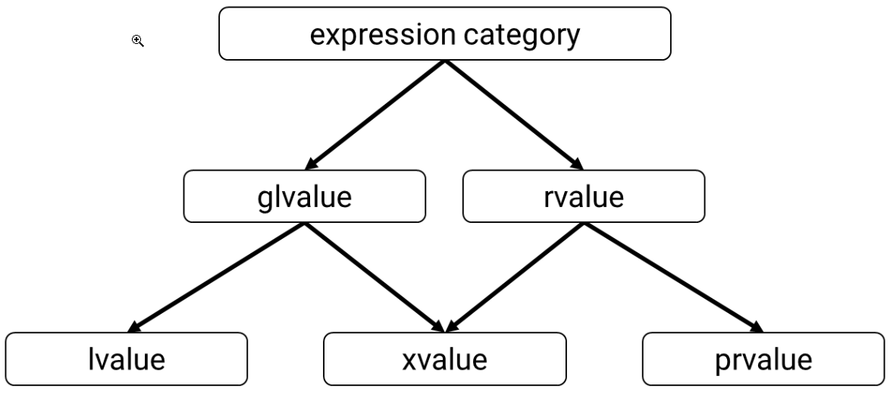

## Non movable and non-copyable type 

 
```
#include <iostream> 
#include <array>

using namespace std; 

struct NonMoveable 
{ 
  NonMoveable(int x) : v(x) { } 
  NonMoveable(const NonMoveable&) = delete; 
  NonMoveable(NonMoveable&&) = delete; 
  std::array<int, 1024> arr; 
  int v; 
}; 

NonMoveable make(int val) 
{ 
  if (val > 0) 
    return NonMoveable(val); 
  return NonMoveable(-val); 
} 

int main() 
{ 
  auto largeNonMoveableObj = make(90); // construct the object 
  cout << "The v of largeNonMoveableObj is: " <<largeNonMoveableObj.v <<endl; 
  return largeNonMoveableObj.v; 
} 
```

The above code wouldn’t compile under C++14 as it lacks copy and move constructors. But with C++17 the constructors are not required - because the object largeNonMovableObj will be constructed in place. Moreover, it’s important to remember, that in C++17 copy elision works only for unnamed temporary objects, and Named RVO is not mandatory. 

## Value Categories: 

`lvalue` - an expression that can appear on the left-hand side of an assignment. An expression that has an identity, and which we can take the address of. 
`rvalue` - an expression that can appear only on the right-hand side of an assignment 
`xvalue` - an eXpiring lvalue, "eXpiring lvalue" - an object that we can move from, which we can reuse. Usually, its lifetime ends soon 
`prvalue` - a pure rvalue, an xvalue, a temporary object or sub-object, or a value that is not associated with an object, something without a name, which we cannot take the address of, we can move from such expression. A `prvalue` is an expression whose evaluation initializes an object, bit-field, or operand of an operator, as specified by the context in which it appears 

glvalue - a generalised lvalue, which is an lvalue or an xvalue, a glvalue is an expression whose evaluation computes the location of an object, bit-field, or function 

 
 
```
class X { int a; }; 
X{10}   // this expression is prvalue 
X x;    // x is lvalue 
x.a     // it's lvalue (location) 
```

# Questions: 

## What is copy elision and how does it help in C++? 

Copy elision is a technique used in C++ to optimize the performance of copying objects. The C++ Standard specifies that certain copies can be omitted in certain situations, such as when an object is returned from a function by value. This can help to avoid unnecessary memory allocation and deallocation, as well as the overhead of copying large objects. 

In C++11 and C++14, copy elision was an implementation detail that was allowed but not required by the Standard. This meant that different compilers might perform copy elision to different degrees, depending on their implementation. 

In C++17, copy elision was made mandatory in certain situations specified in the standard. This means that every compiler that follows C++17 standard should perform copy elision in those situations, which makes the program behavior more predictable. These situations are called "context where copy can be elided". 

This will lead to more efficient and better performance of the code , and it is a feature that could potentially save a lot of computational time and memory usage on large datasets. 
```
#include <iostream> 

class MyClass { 
public: 
    MyClass() { std::cout << "MyClass default constructor" << std::endl; } 
    MyClass(const MyClass&) { std::cout << "MyClass copy constructor" << std::endl; } 
    MyClass(MyClass&&) { std::cout << "MyClass move constructor" << std::endl; } 
}; 

MyClass GetMyClass() { 
    MyClass local;  
    return local;  
} 

int main() { 
    MyClass a = GetMyClass();  
    // Output: MyClass default constructor  
    // in C++17 this will not output copy or move constructor,  
    // because copy elision will happen  
} 
```

## What are unnamed temporary objects? 

In C++, an unnamed temporary object is an object that is created without an explicit name by the compiler. These objects are often created when a function returns a value, or when a value is created as the result of an expression. 
```
int a = 5;  
int b = a + 10; 
```
Here, when the expression a + 10 is evaluated, the compiler creates an unnamed temporary object that holds the value 15. This object is then used to initialize the variable b. The temporary object is unnamed and is immediately destroyed after b is initialized. 
```
MyClass foo(){ 
  return MyClass(); 
} 
```
Here, inside the foo function, a temporary object of type MyClass is created by the compiler with the default constructor. This object is returned by the function and a copy or move constructor of the temporary object will be used to assign the returned value to the variable. 

## What is memory alignment in C++17? 

In computer science, memory alignment refers to the way data is arranged in memory. When data is stored in memory, it is typically grouped into blocks of bytes, called memory addresses. In order to improve performance, modern CPUs often require that data be aligned on specific memory boundaries. This means that the memory address of a piece of data must be a multiple of a specific value. The specific value that a piece of data must be aligned to depends on the data type and the CPU architecture. 

In C++, memory alignment is typically handled by the compiler and the operating system. However, C++17 introduced a new feature called "aligned new" that allows developers to specify the alignment of dynamically allocated memory. 

Here's an example of how to use aligned new to allocate a block of memory that is aligned to a 64-byte boundary: 

``` 
#include <iostream> 
#include <new> // for aligned_alloc 

int main() { 
    double* p = new (std::align_val_t(64)) double[3]; 
    // allocate a block of memory that is aligned to a 64-byte boundary 
    std::cout << "p = " << p << std::endl; 
    delete[] p; 
} 
``` 
Here, the new operator is used with the std::align_val_t class template to specify the alignment of the memory block. This causes the new operator to use the aligned_alloc function from the C library to allocate memory with the specified alignment. The delete operator is used to deallocate the memory when it's no longer needed. 

This feature will allow you to use aligned memory allocation which can improve performance of your application, especially if it deals with large data sets, multimedia or other applications that need to process data in blocks and/or use vectorized instructions. 

Note that, You should also be aware of the alignment restrictions of your target platform and choose the alignment accordingly. 

## What is non-default memory alignment for memory allocation? 

In C++, when you allocate memory dynamically using the new operator or the malloc function, the memory returned by these functions is aligned on a default boundary, which is typically a multiple of 4 or 8 bytes. This is called "default memory alignment". 

"Non-default memory alignment" refers to the practice of allocating memory on a boundary that is not the default boundary. This is often done to optimize the performance of certain types of computations, such as those that involve vector operations. 

For example, if you have a data structure that contains a large number of vectors, and you want to perform vector operations on them, it can be more efficient to allocate each vector on a boundary that is a multiple of the size of the vector, rather than a multiple of 4 or 8 bytes. This can help to reduce the number of cache misses that occur when accessing the vectors, which can result in a significant performance boost. 

In C++, you can use the operator new[] with a second parameter to specify the alignment in bytes. For example, 
```
float* data = new (std::align_val_t(16)) float[100]; 
```
This will align memory on 16-bytes boundary. 

Alternatively, there are also various libraries and frameworks available that provide a higher-level interface for allocating aligned memory. Such as `<cstdlib>` and `<mm_malloc.h>` headers for C++ , which provide specific allocation functions for aligned memory. 

## Dynamic Memory Allocation for Over-Aligned Data: 

``` 

#include <cassert> 

#include <iostream> 

#include <memory> 

#include <new> 

#include <vector> 

 
 

#if defined(_WIN32) || defined(__CYGWIN__) 

#    include <malloc.h> // _aligned_malloc/_aligned_free 

 
 

    void* custom_aligned_alloc(size_t size, size_t alignment) { 

        return _aligned_malloc(size, alignment); 

    } 

    void custom_aligned_free(void* ptr) { 

        _aligned_free(ptr); 

    } 

#else 

#    include <cstdint>  // aligned_alloc from C11 

 
 

    void* custom_aligned_alloc(size_t size, size_t alignment) { 

        return std::aligned_alloc(alignment, size); 

    } 

    void custom_aligned_free(void* ptr) { 

        std::free(ptr); 

    } 

#endif 

 
 

void* operator new(std::size_t size, std::align_val_t align) { 

    auto ptr = custom_aligned_alloc(size, static_cast<std::size_t>(align)); 

 
 

    if (!ptr) 

        throw std::bad_alloc{}; 

 
 

    std::cout << "new: " << size << ", align: " << static_cast<std::size_t>(align) << ", ptr: " << ptr << '\n'; 

 
 

    return ptr; 

} 

 
 

void operator delete(void* ptr, std::size_t size, std::align_val_t align) noexcept { 

    std::cout << "delete: " << size << ", align: " << static_cast<std::size_t>(align) << ", ptr : " << ptr << '\n'; 

    custom_aligned_free(ptr); 

} 

 
 

void operator delete(void* ptr, std::align_val_t align) noexcept { 

    std::cout << "delete: align: " << static_cast<std::size_t>(align) << ", ptr : " << ptr << '\n'; 

    custom_aligned_free(ptr); 

} 

 
 

struct alignas(32) Vec3dAVX { 

    double x, y, z; 

}; 

 
 

int main() { 

    std::cout << "__STDCPP_DEFAULT_NEW_ALIGNMENT__ is " << __STDCPP_DEFAULT_NEW_ALIGNMENT__ << std::endl; 

 
 

    std::cout << "sizeof(Vec3dAVX) is " << sizeof(Vec3dAVX) << '\n'; 

    std::cout << "alignof(Vec3dAVX) is " << alignof(Vec3dAVX) << '\n'; 

 
 

    { 

        std::cout << "---- new Vec3dAVX[10]\n"; 

        auto pVec = new Vec3dAVX[10]; 

        assert(reinterpret_cast<uintptr_t>(pVec) % alignof(Vec3dAVX) == 0); 

        delete[] pVec; 

    } 

 
 

    { 

        std::cout << "---- new int[10]\n"; 

        auto p2 = new int[10]; 

        delete[] p2; 

    } 

 
 

    { 

        std::cout << "---- vector<Vec3dAVX>\n"; 

        std::vector<Vec3dAVX> vec; 

        vec.push_back({}); 

        vec.push_back({}); 

        vec.push_back({}); 

        assert(reinterpret_cast<uintptr_t>(vec.data()) % alignof(Vec3dAVX) == 0); 

    } 

     

    { 

        std::cout << "---- unique_ptr<Vec3dAVX[]>\n"; 

        auto pUnique = std::make_unique<Vec3dAVX[]>(10); 

    } 

} 

``` 

## Exception Specifications in the Type System: 

``` 
using TNoexceptVoidFunc = void (*)() noexcept; // define a type TNoexceptVoidFunc which is pointer to a function that takes no arguments, returns void and has noexcept specifier 

void SimpleNoexceptCall(TNoexceptVoidFunc f) { 

    f(); // call the function passed as parameter 

} 

 
 

using TVoidFunc = void (*)(); // define a type TVoidFunc which is pointer to a function that takes no arguments and returns void 

 
 

void SimpleCall(TVoidFunc f) { 

    f(); // call the function passed as parameter 

} 

 
 

void fNoexcept() noexcept { } // define a function fNoexcept which takes no arguments and returns void, also has noexcept specifier 

void fRegular() { } // define a function fRegular which takes no arguments and returns void, without noexcept specifier 

 
 

int main() { 

    SimpleNoexceptCall(fNoexcept); // pass fNoexcept to SimpleNoexceptCall function 

    //SimpleNoexceptCall(fRegular); // the line will not work as fRegular doesn't have noexcept specifier 

     

    SimpleCall(fNoexcept); // pass fNoexcept to SimpleCall function, will be converted to regular function 

    SimpleCall(fRegular); // pass fRegular to SimpleCall function 

} 

``` 

## Question: What are Fold expressions in C++17? 

 

Fold expressions in C++17 are a feature of the C++ programming language that allow for more concise and expressive code when working with template metaprogramming. They are used to perform operations on a parameter pack, which is a variable number of arguments passed to a template. There are two types of fold expressions: left fold and right fold. 

A left fold applies an operator to the elements of a parameter pack, going from left to right. For example, given a parameter pack args and an operator op, the following left fold expression: 

`(... op args)` 

 

is equivalent to: 

 

`(op(...(op(args0, args1), args2), ...), argsN)` 

 

A right fold is similar, but the order of the elements is reversed, so it goes from right to left: 

 

`(args ... op)` 

 

is equivalent to: 

 

`(argsN, ...(args2, op(args1, args0)) )` 

 

Fold expressions open up a lot of possibilities for generic and template metaprogramming in C++, making it easier to write expressive, efficient, and readable code. 

Different types of make_TYPE (like make_pair) functions in C++17 vs earlier version 

`std::pair<int, std::string> myPair(42, "hello world");` can be written as `auto myPair = std::make_pair(42, "hello world");` the code will be faster (probably) as well. 